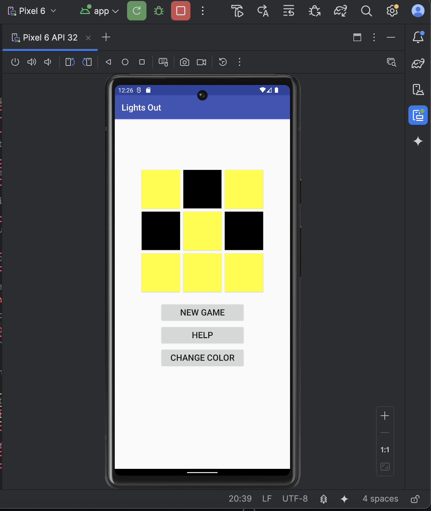
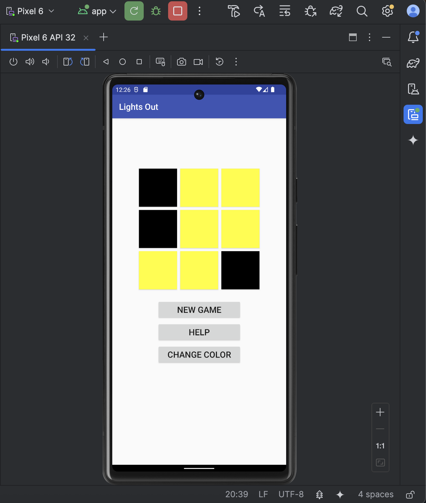
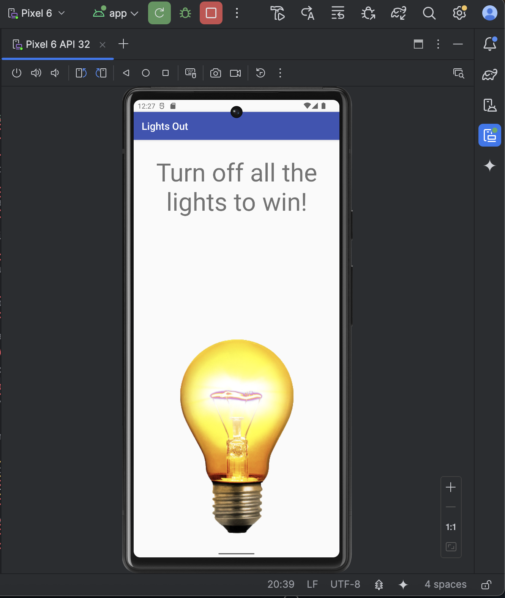
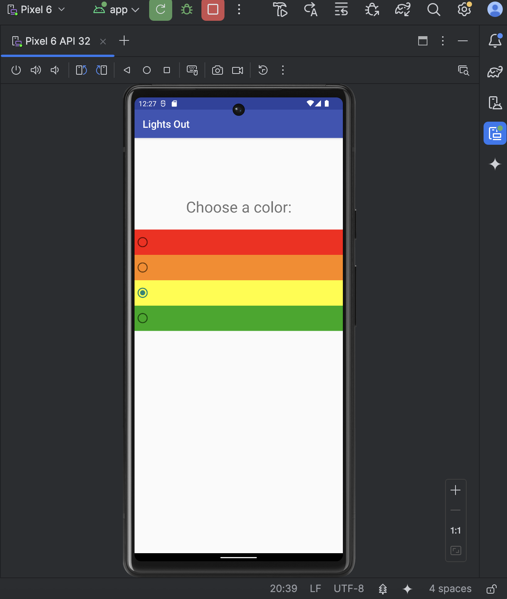
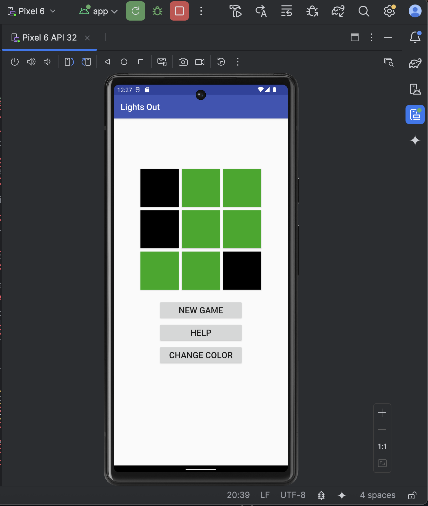

# Lights Out 🔆

A simple Android puzzle game built with Kotlin.  
Tap tiles to toggle their state — and the state of their neighbors — with the goal of turning **all lights off**.  
Includes multiple color themes and a help screen explaining the rules.

---

## 📸 Screenshots

### Game Start

### After Tapping Tiles

### Help Screen

### Color Selection

### After Color Change

---

## ✨ Features

- **Classic Lights Out gameplay**
- **3×3 tile grid**
- Tiles toggle their own color + neighbors
- **New Game** button to reset the board
- **Help** screen describing the rules
- **Change Color** screen with multiple color themes
- Clean and simple UI

---

## 🧰 Tech Stack

- **Kotlin**
- **Android Studio**
- Activities + Intents
- ConstraintLayout UI
- Custom drawables for tiles

---

## ▶️ How to Play

1. Tap a tile.  
2. The tile and its neighbors switch color.  
3. Turn every tile dark to win.  
4. Use **Change Color** to try different themes.  
5. Use **Help** anytime for instructions.

---

## 📂 Project Overview

This project is organized in the standard Android structure:

- `java/edu/lukina/lightsout/` — Kotlin game logic & activities  
- `res/layout/` — XML UI screens  
- `res/drawable/` — tile graphics / backgrounds  
- `screenshots/` — images used in this README  

---
